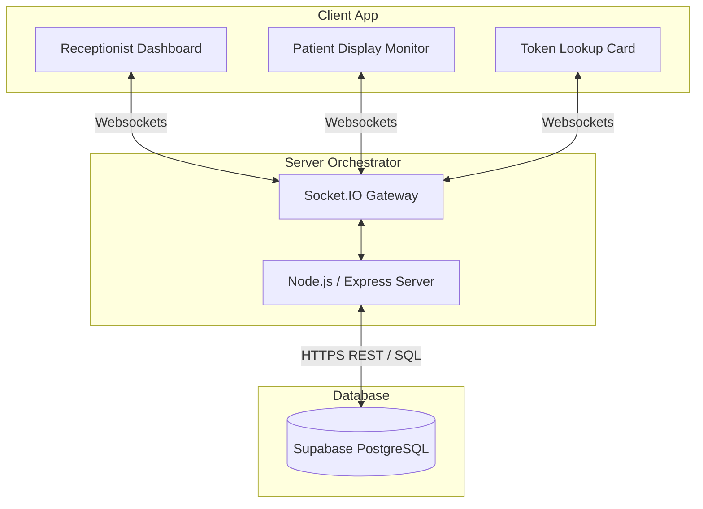

# ClinicFlow 🏥

**Smart Real-Time Clinic Queue Management System**

ClinicFlow is a real-time, responsive full-stack queue management platform designed for the **Queue Cure '26** Hackathon. It replaces outdated paper token systems and shouting with an automated, live-synchronized dashboard.

---

## 📝 Problem Statement

Traditional outpatient clinics in India face major operational challenges:
1. **Long Waiting Times**: Patients wait 2–3 hours with zero visibility into their queue status, leading to crowded, stressful waiting rooms.
2. **Receptionist Burnout**: Staff must manually manage patient check-ins, tracking tokens, and calling out numbers from memory.
3. **No Dynamic Insights**: Average consultation and wait times are guessed rather than calculated from actual data.

**ClinicFlow** resolves this by providing a real-time synchronized dashboard. Receptionists manage queues effortlessly, while patients track their status, tokens ahead, and live estimated wait times from their own devices.

---

## ✨ Features

- **Real-Time Synchronization**: All screens update instantly using WebSockets via `Socket.IO` as soon as a receptionist takes an action.
- **Stateless Server Resiliency**: The backend syncs active patient tokens from Supabase dynamically on boot, preventing data loss or desync upon server restarts.
- **Dynamic Estimated Wait Time**: Computes patient wait times dynamically based on the moving average of completed consultations:
  $$\text{Wait Time} = \text{Patients Ahead} \times \text{Average Consultation Time}$$
- **Mistake-Proof Registration**: Simple input box with "Enter to submit" controls and dynamic loading/disabled button states to prevent double submissions.
- **Concurrency & Double-Click Lock**: Implements an atomic server-side transaction lock (`isProcessing`) to prevent race conditions during rapid receptionist inputs.
- **Active Token Tracker**: Patients can look up their token number to view their position in line and specific estimated wait time.
- **Silent Autoplay Audio Alerts**: Global click handlers unlock the browser audio context silently on the first interaction, delivering loud, reliable bell alerts to the waiting room without intrusive pop-ups.
- **Audio Mounting Guard**: Uses React refs to block initial page load trigger sound effects, ensuring dings only sound when a *new* token is actually called.
- **Fullscreen Optimized Layout**: A responsive design built for 1920x1080 screens to display clearly on large waiting room monitors.
- **QR Code Sharing**: Integrated QR card for quick waiting-room mobile check-ins.

---

## 🛠️ Tech Stack

* **Frontend**: React (Vite), React Router, Tailwind CSS, Socket.IO-Client
* **Backend**: Node.js, Express, Socket.IO
* **Database**: Supabase (PostgreSQL)
* **Deployment**: Vercel (Frontend), Render (Backend)

---

## 📊 Database Schema (Important for Judges)

The system uses a Supabase PostgreSQL backend database. Below is the structure of the `patients` table:

| Column Name | Type | Description |
| :--- | :--- | :--- |
| `id` (PK) | `bigint` | Auto-incremented unique database record ID. |
| `token` | `integer` | Sequence patient token number (resets to 1 when queue is cleared). |
| `name` | `text` | Patient's registered name. |
| `status` | `text` | Current status: `'waiting'`, `'serving'`, or `'completed'`. |
| `joined_at` | `timestamp` | Time when the patient was registered. Defaults to database current time. |
| `start_time` | `timestamp` | Timestamp when the receptionist clicked "Call Next" (started consultation). |
| `end_time` | `timestamp` | Timestamp when the next patient was called (ended consultation). |
| `consultation_duration` | `integer` | Calculated duration in minutes (end_time - start_time) . |

---

## 🏗️ Architecture



---

## 📦 Installation & Setup

### 1. Clone the Repository
```bash
git clone <repository-url>
cd clinic-flow
```

### 2. Install Dependencies
```bash
# Setup Backend
cd backend
npm install

# Setup Frontend
cd ../frontend
npm install
```

### 3. Environment Variables Setup
Create a `.env` file inside the `backend/` directory:
```env
SUPABASE_URL=your_supabase_project_url
SUPABASE_KEY=your_supabase_anon_public_key
```

### 4. Run Locally
```bash
# Start backend server (starts on Port 5000)
cd backend
npm start

# Start frontend Vite development server (in a separate terminal)
cd frontend
npm run dev
```

---

## 🔮 Future Enhancements

- **Doctor Dashboard**: Dedicated interface for doctors to update diagnosis logs and notes.
- **SMS Notifications**: Automated SMS text alerts when a patient is 2 tokens away.
- **Voice Token Announcements**: Text-to-speech engine to call tokens aloud (e.g., *"Token 5, please proceed to Consulting Room 1"*).
- **Appointment Scheduling**: Pre-booking slots online before arriving at the clinic.
- **Analytics Dashboard**: Historical reports on busiest hours and peak waiting times.
- **Multi-Clinic Support**: Support for multiple departments and doctors within a single system.
