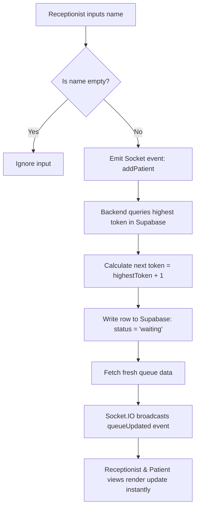
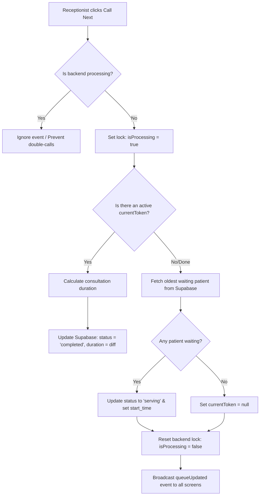
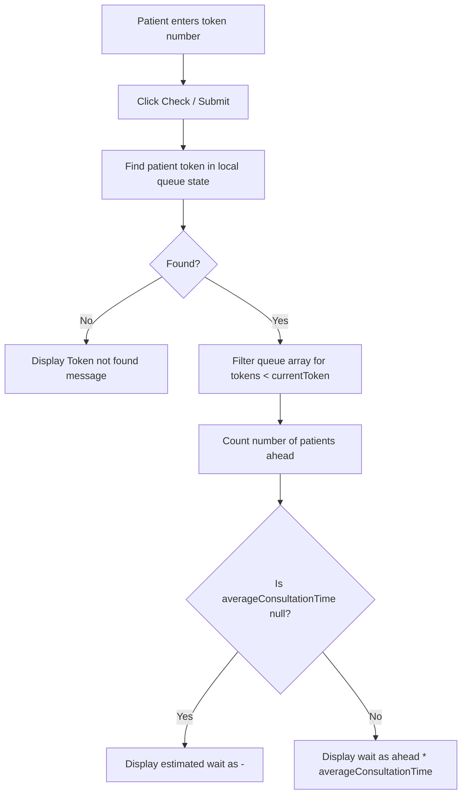

# ClinicFlow Process Flow Sheet

This process flow sheet outlines the step-by-step execution path for patient registration, calling next tokens, and patient self-tracking.

---

## 1. Patient Registration Workflow

This process registers a new patient in the queue and alerts all screens:

### Steps:
1. **Input Name**: The receptionist enters the patient's name into the input field and presses Enter or clicks "Register".
2. **Validation**: The client-side code checks that the text is not empty or whitespace.
3. **Socket Emission**: The frontend client emits the `"addPatient"` event with the patient's name.
4. **Database Query**: The backend server Queries Supabase to find the maximum token value registered:
   * If there are no entries, token defaults to `1`.
   * Otherwise, the next token is $\text{lastToken} + 1$.
5. **Database Write**: Backend inserts a new row in Supabase:
   * `name`: *Patient Name*
   * `token`: *Next Token*
   * `status`: `'waiting'`
   * `joined_at`: `CURRENT_TIMESTAMP`
6. **State Synchronization**: Server fetches the updated queue and emits `"queueUpdated"`.

---

## 2. Calling Next Patient Workflow

This process completes the current consultation and starts the next one, updating stats and triggering the waiting room buzzer:

### Steps:
1. **Action Request**: Receptionist clicks "Call Next". The button is disabled during processing.
2. **Concurrency Lock**: Backend checks `isProcessing` flag. If false, sets to true to prevent database write conflicts.
3. **Complete Active Patient**:
   * If there is an active `currentToken` (serving), the server retrieves their record.
   * Compares the `start_time` to the current time to compute the elapsed duration in minutes:
     $$\text{Duration} = \max\left(1, \text{round}\left(\frac{\text{CurrentTime} - \text{StartTime}}{60000}\right)\right)$$
   * Updates that patient row: `status` = `'completed'`, `end_time` = `CurrentTime`, `consultation_duration` = `Duration`.
4. **Promote Next Patient**:
   * Server fetches the patient row with `status` = `'waiting'` ordered by `token` ascending (FIFO).
   * Updates that row: `status` = `'serving'`, `start_time` = `CurrentTime`.
5. **Buzzer Notification**:
   * Backend broadcasts the `"queueUpdated"` state payload.
   * The Patient Display Screen reads the updated payload, detects the token change, bypasses the initial mount guard, and triggers a chime notification to alert the waiting room.

---

## 3. Patient Position Tracking Workflow

This process allows patients to check their specific queue position and wait times:

### Steps:
1. **Enter Token**: The patient inputs their token number into the lookup search bar in the waiting room layout.
2. **Local Scan**: The React component searches the `queue` array in memory for the match.
3. **Queue Position Calculation**:
   * Counts the number of active patients in the array whose status is `'waiting'` or `'serving'` and whose token number is less than the patient's token.
4. **Estimated Wait Calculation**:
   * If there are `0` patients ahead: estimated wait is `0 mins`.
   * If there are patients ahead but the average consultation time is `null` (no completed data yet), estimated wait is rendered as `-`.
   * Otherwise, the wait is:
     $$\text{Estimated Wait} = \text{Patients Ahead} \times \text{Average Consultation Time} \text{ mins}$$
