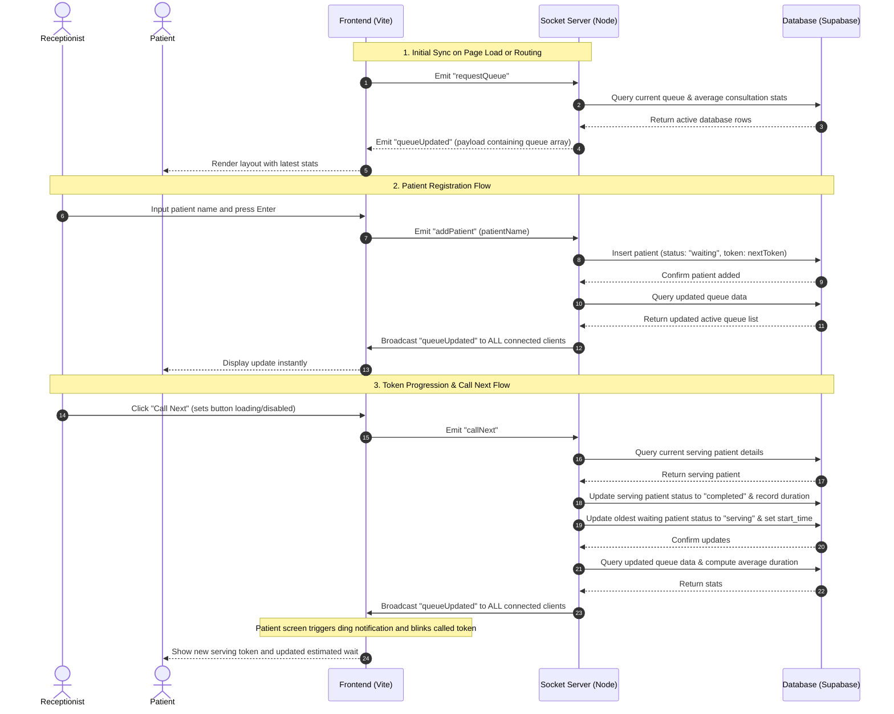

# ClinicFlow Socket.IO Flow Diagram

This document contains flowcharts and descriptions of the real-time websocket event flows in **ClinicFlow**, suitable for presentation slides (PPT) or design documentation.

---

## 1. System Communication Layout (ASCII Art)
Copy this ASCII structure for reports or presentations:

```text
                  +-----------------------------------+
                  |      Receptionist Dashboard       |
                  +-----------------+-----------------+
                                    |
                                    | Emit: "addPatient" / "callNext" / "resetQueue"
                                    | Receive: "queueUpdated"
                                    v
                  +-----------------------------------+
                  |        Node.js Backend            |
                  |     (Socket.IO Web Server)        |
                  +-----------------+-----------------+
                                    |
                  +-----------------+-----------------+
                  |                                   |
                  v                                   v
        +-------------------+               +-------------------+
        | Supabase Database |               | Socket Broadcast: |
        |   (PostgreSQL)    |               |  "queueUpdated"   |
        +-------------------+               +---------+---------+
                                                      |
                             +------------------------+------------------------+
                             |                                                 |
                             v                                                 v
                  +-------------------+                             +-------------------+
                  |  Reception Screen |                             |   Patient Screen  |
                  +-------------------+                             +-------------------+
```

---

## 2. Dynamic Sequence Diagram (Mermaid)

This diagram details the sequence of events when a patient is added or called next:



---

## 3. Event Catalog

### A. Client-to-Server Events

1. **`requestQueue`**
   * **Trigger**: Triggered on mounting `Receptionist.jsx` or `PatientView.jsx` (`useEffect` hook).
   * **Purpose**: Fetches the current database state immediately so that the page is not blank.

2. **`addPatient`**
   * **Payload**: `(name: string)`
   * **Purpose**: Registers a new patient. The server inserts a row in Supabase with status `'waiting'` and broadcasts the update.

3. **`callNext`**
   * **Payload**: None
   * **Purpose**: Promotes the oldest waiting patient to `'serving'` and marks the currently serving patient as `'completed'`.

4. **`resetQueue`**
   * **Payload**: None
   * **Purpose**: Deletes all rows in the Supabase `patients` table and resets the token counter to `1`.

### B. Server-to-Client Events

1. **`queueUpdated`**
   * **Payload**:
     ```json
     {
       "queue": [
         { "id": 12, "token": 3, "name": "Raj", "status": "serving", "joined_at": "..." },
         { "id": 13, "token": 4, "name": "Devi", "status": "waiting", "joined_at": "..." }
       ],
       "currentToken": 3,
       "averageConsultationTime": 6
     }
     ```
   * **Purpose**: Sent to all connected clients to trigger real-time updates and notifications.
