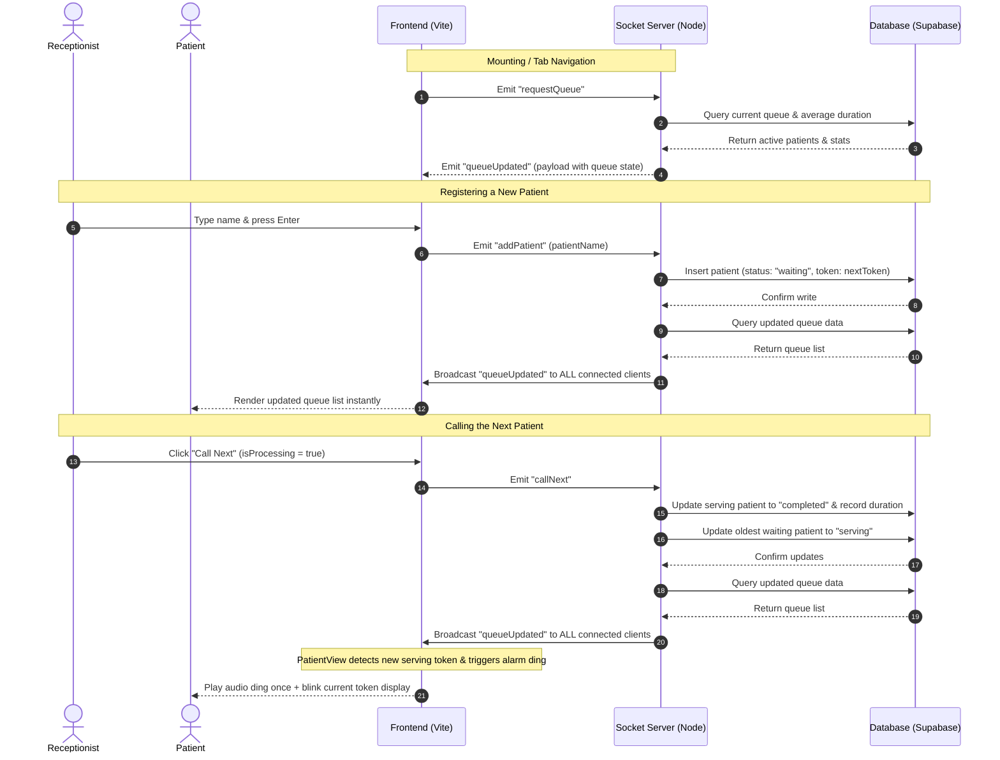

# ClinicFlow Socket Event Diagram

This document illustrates the real-time communication architecture between the clients (Receptionist dashboard, Patient monitor display) and the Node.js WebSocket server.



## Description of Events

1. **`requestQueue` (Client -> Server)**:
   - **When**: Triggered immediately when a client page mounts (either Receptionist dashboard or Patient view) or when the user navigates between views using React Router.
   - **Why**: Synchronizes local component state immediately with the active database, preventing blank lists on mount.

2. **`queueUpdated` (Server -> Client Broadcast)**:
   - **When**: Sent whenever the queue state undergoes a change (new patient registered, next patient called, or queue reset) or upon `requestQueue`.
   - **Payload**:
     ```json
     {
       "queue": [
         { "id": 1, "token": 1, "name": "Ravi", "status": "serving", "joined_at": "..." },
         { "id": 2, "token": 2, "name": "Kamal", "status": "waiting", "joined_at": "..." }
       ],
       "currentToken": 1,
       "averageConsultationTime": 5
     }
     ```

3. **`addPatient` (Client -> Server)**:
   - **When**: Receptionist enters a name and clicks "Register" or presses Enter.
   - **Effect**: Triggers database write for a new patient entry, followed by a broadcasted `queueUpdated` event.

4. **`callNext` (Client -> Server)**:
   - **When**: Receptionist clicks the "Call Next" button.
   - **Effect**: Completes the active patient, calculates and records their exact consultation duration, transitions the next patient to "serving", and triggers a broadcasted `queueUpdated` event.
